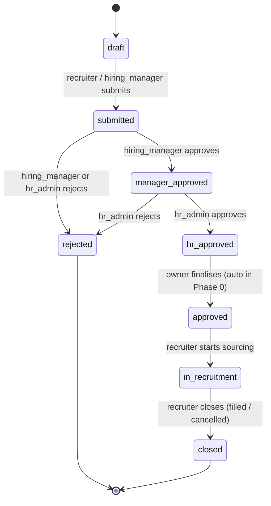
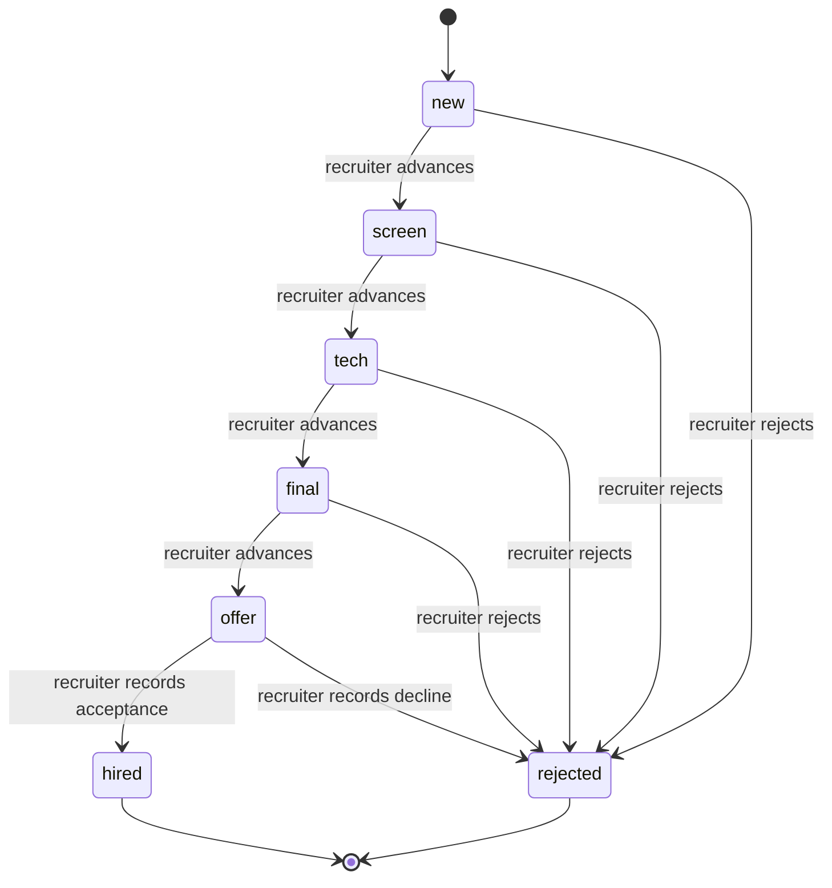
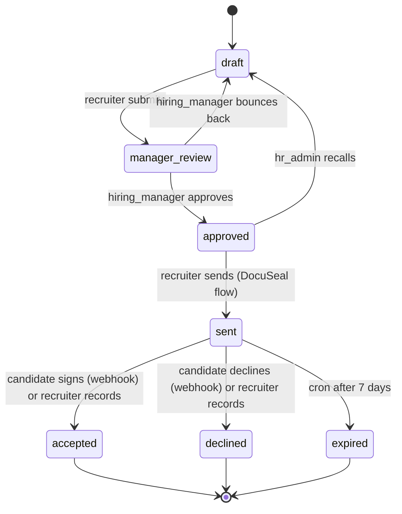

# 20 — Finite State Machines

Two FSMs are enforced at the service layer in Phase 0. Both follow the same shape:

```ts
canTransition(from: Stage, to: Stage, actorRoles: Role[]): boolean
```

Pure functions, no I/O, fully unit-tested. Routes call `canTransition` before any update; on a forbidden transition the route returns **HTTP 422** with a structured error code (`fsm.forbidden_transition`).

> RLS is the second line of defence. Do not skip `canTransition` because RLS "would have caught it".

## HiringRequisition



Status enum: `draft`, `submitted`, `manager_approved`, `hr_approved`, `approved`, `in_recruitment`, `closed`, `rejected`.

### Allowed transitions by role

| From → To | Allowed roles |
| --- | --- |
| `draft → submitted` | `recruiter`, `hiring_manager`, `hr_admin`, `owner` |
| `submitted → manager_approved` | `hiring_manager`, `hr_admin`, `owner` |
| `submitted → rejected` | `hiring_manager`, `hr_admin`, `owner` |
| `manager_approved → hr_approved` | `hr_admin`, `owner` |
| `manager_approved → rejected` | `hr_admin`, `owner` |
| `hr_approved → approved` | `hr_admin`, `owner` (auto in Phase 0) |
| `approved → in_recruitment` | `recruiter`, `hr_admin`, `owner` |
| `in_recruitment → closed` | `recruiter`, `hr_admin`, `owner` |

All other transitions are rejected by `canTransition`. `owner` is always allowed any legal transition (super-user inside its tenant).

### Side-effects

- On `approved → in_recruitment`, a `Vacancy` row is created or unhidden.
- Every transition writes an `AuditEvent` (`requisition.submit`, `requisition.manager_approve`, etc.).

## Application (Kanban funnel)



Stage enum: `new`, `screen`, `tech`, `final`, `offer`, `hired`, `rejected`.

### Allowed transitions by role

| From → To | Allowed roles |
| --- | --- |
| `new → screen` | `recruiter`, `hr_admin`, `owner` |
| `screen → tech` | `recruiter`, `hr_admin`, `owner` |
| `tech → final` | `recruiter`, `hiring_manager`, `hr_admin`, `owner` |
| `final → offer` | `recruiter`, `hr_admin`, `owner` |
| `offer → hired` | `recruiter`, `hr_admin`, `owner` |
| `* → rejected` (any non-terminal stage) | `recruiter`, `hr_admin`, `owner` |
| Backward transitions (`screen → new`, etc.) | `hr_admin`, `owner` only (correction path) |

`hired` and `rejected` are terminal. Backward transitions exist to correct mistakes and are deliberately restricted to admin roles.

### Side-effects

- Every transition writes an `ApplicationStageEvent` row with `from_stage`, `to_stage`, `actor_user_id`, and optional `comment`.
- Every transition writes an `AuditEvent` row (`application.move_stage`).
- The Notifier emits `application.stage_changed` to the recruiter assigned to the application (in_app channel today).

## Test coverage requirement

- Each FSM module has a unit test that **enumerates every (from, to, role) triple** and asserts the legal/illegal verdict matches the tables above.
- The legal-transition matrix in tests is generated from a single source-of-truth constant, so adding a transition is one diff: schema + FSM constant + this doc.

## Offer (Phase 3)



Status enum: `draft`, `manager_review`, `approved`, `sent`, `accepted`,
`declined`, `expired`.

### Allowed transitions by role

| From → To | Allowed roles |
| --- | --- |
| `draft → manager_review` | `recruiter`, `hr_admin`, `owner` |
| `manager_review → approved` | `hiring_manager`, `hr_admin`, `owner` |
| `manager_review → draft` | `hiring_manager`, `hr_admin`, `owner` |
| `approved → sent` | `recruiter`, `hr_admin`, `owner` |
| `approved → draft` | `hr_admin`, `owner` (admin recall) |
| `sent → accepted` | `recruiter`, `hr_admin`, `owner`, `candidate` (webhook) |
| `sent → declined` | `recruiter`, `hr_admin`, `owner`, `candidate` (webhook) |
| `sent → expired` | `hr_admin`, `owner` (cron) |

`accepted`, `declined`, and `expired` are terminal.

### Side-effects

- `approved → sent`: stamps `sent_at = now()` and `expires_at = now() + 7d`.
  When `DOCUSEAL_ENABLED=true` we create a DocuSeal submission and store
  `docuseal_submission_id` + `docuseal_signing_url`. The candidate is
  notified on `in_app` (plus `email` when `EMAIL_ENABLED=true`).
- `sent → accepted`: stamps `accepted_at`. Moves the linked Application to
  `hired` and runs `createFromApplication` (creates the `Employee` row and
  opens the pre-start portal).
- `sent → declined`: stamps `declined_at` and `declined_reason`. Moves the
  linked Application to `rejected`.
- `sent → expired`: stamps nothing else; the `offer:expire` cron task is the
  only allowed actor.
- Every transition writes an `AuditEvent`. Webhook- and cron-triggered
  transitions write `actor_user_id = NULL`.
