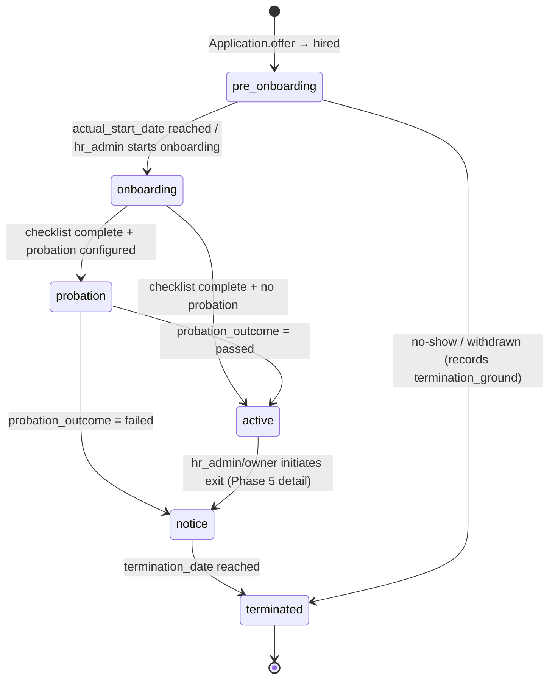

# Employee lifecycle — design spec (v1.2)

> **Status:** canonical source of truth for Phase 4 (issue #21) and its sub-issues #22–#30. Companion to `docs/contracts/*.md` — read `00-overview.md`, `10-data-model.md`, `20-fsm.md`, `30-rls-policies.md`, `40-audit.md`, `50-coding-standards.md` first.
>
> **Scope:** extends `hr-system` beyond the recruiting funnel (terminal at `Application.stage = hired`) into the employee lifecycle: `pre_onboarding → onboarding → probation → active`.
>
> **Out of scope (Phase 4):** `EmploymentDocument` e-signing via DocuSeal (Phase 3), offboarding / alumni (Phase 5).

## Sub-issue cross-reference index

The 9 sub-issues reference both `§1–§7` (this document) and `§9.x` (role-specific). The `§9.x` material lives in **Appendix A — Role scenarios** below; the table maps the references so each sub-issue is executable as written.

| Sub-issue ref | Section in this doc |
| --- | --- |
| §9.3 — probation criteria for `logist` | Appendix A.3 |
| §9.5 — `logist` onboarding task list | Appendix A.2 |
| §9.6 — Employment form by candidate competencies | Appendix A.1 |
| roadmap §7.4 — pre-start portal reuse | §5.3 |

---

## §1 Overview & handoff

### §1.1 Scope

The recruiting funnel terminates at `Application.stage = hired`. From that point a new aggregate — `Employee` — owns the lifecycle. The Phase 4 lifecycle is a four-state FSM (see §3):

```
pre_onboarding → onboarding → probation → active
```

Side-tracks (`notice`, `terminated`) are reachable from `probation` and `active` and are recorded but the full offboarding flow is deferred to Phase 5; only the transitions and audit are in scope here.

Single-tenant today; every new table has `tenant_id UUID NOT NULL` per `docs/contracts/10-data-model.md`. Primary keys are `uuidv7()`; column names are snake_case via `@map`.

### §1.2 Handoff: `Application.offer → hired` creates `Employee`

The `offer → hired` transition in the recruiting FSM (`docs/contracts/20-fsm.md`) is the **only** path that creates an `Employee` row. The service-layer side-effect:

1. Inside the same transaction as the stage update, `employee.createFromApplication(applicationId)` runs.
2. It snapshots the agreed terms onto `Employee`: `candidate_id`, `application_id`, `org_unit_id`, `requisition_id`, `position`, `grade`, `currency`, `agreed_base_salary`, `agreed_employment_type`, `agreed_start_date`. The snapshot decouples lifecycle data from later edits to the `Application` / `Requisition`.
3. New `Employee.status = pre_onboarding`.
4. An `AuditEvent` is written with `action = 'employee.created'` and `diff` carrying `via = 'hired_application'`.
5. A `User(role = employee)` link is **not** required at this moment — `hr_admin` links a `User` later (self-service portal access begins when the link exists). The model permits `Employee.user_id IS NULL` until that step.

Invariant: **one `Employee` per hired `Application`** (`Employee.application_id UNIQUE`). Re-running `offer → hired` after a rollback must reuse the existing `Employee` row, not create a second.

### §1.3 Reused entities

- `Application`, `Candidate`, `HiringRequisition`, `OrgUnit`, `User`, `Role`, `AuditEvent` — unchanged. Only new relations are added.
- `Notifier`, `Queue` stubs from Phase 0 — reused for lifecycle events and scheduled jobs (§5.2, §6.2).
- Quiet Hours helper (`backend/src/features/messaging/quiet-hours.ts`) — reused for any automated outbound on lifecycle events.

---

## §2 Data model

Prisma models and PostgreSQL enums introduced in Phase 4. The Prisma schema in `backend/prisma/schema.prisma` is the executable source of truth; this section is the human-readable contract (`docs/contracts/10-data-model.md` conventions apply).

### §2.1 Enums

| Enum | Values |
| --- | --- |
| `EmployeeStatus` | `pre_onboarding`, `onboarding`, `probation`, `active`, `notice`, `terminated` |
| `EmploymentType` | `td` (трудовой договор), `gph` (договор ГПХ), `self_employed` (самозанятый), `ip` (ИП) |
| `TerminationGround` | `probation_failed`, `voluntary`, `mutual`, `for_cause`, `other` |
| `ProbationOutcome` | `pending`, `passed`, `failed`, `extended` |
| `OnboardingTaskStatus` | `pending`, `in_progress`, `done`, `failed`, `skipped` |
| `LifecycleEventType` | `status_changed`, `checklist_completed`, `probation_review_recorded`, `document_signed`, `it_provisioning_dispatched`, `it_provisioning_failed` |
| `EmploymentDocumentType` | `td`, `gph`, `self_employed_agreement`, `nda`, `materials_responsibility`, `personal_data_consent` |
| `EmploymentDocumentStatus` | `draft`, `awaiting_signature`, `signed`, `void` |

### §2.2 `Employee`

| Field | Type | Notes |
| --- | --- | --- |
| `id` | UUID | PK, `uuidv7()` |
| `tenant_id` | UUID | not null, RLS-scoped |
| `application_id` | UUID | **UNIQUE**, FK → `Application`. One hired application → one employee. |
| `candidate_id` | UUID | FK → `Candidate` (snapshot at creation). |
| `requisition_id` | UUID | FK → `HiringRequisition` (snapshot). |
| `org_unit_id` | UUID | FK → `OrgUnit`. |
| `user_id` | UUID? | FK → `User`, nullable until `hr_admin` links a portal account. UNIQUE when set. |
| `position` | string | Snapshot of role title (e.g. `Логист-экспедитор`). |
| `grade` | string? | Snapshot. |
| `currency` | string | ISO-4217. |
| `agreed_base_salary` | numeric(12,2) | Snapshot. |
| `agreed_employment_type` | `EmploymentType` | Snapshot. |
| `agreed_start_date` | date | Snapshot. |
| `status` | `EmployeeStatus` | FSM-managed; default `pre_onboarding`. |
| `probation_starts_at` | date? | Set on `onboarding → probation`. |
| `probation_ends_at` | date? | **Required** when `status = probation` (CHECK). |
| `probation_outcome` | `ProbationOutcome` | Default `pending`. |
| `actual_start_date` | date? | First day actually worked; may differ from `agreed_start_date`. |
| `confirmation_date` | date? | Set on `probation → active`. |
| `termination_date` | date? | Set on `* → terminated`. |
| `termination_ground` | `TerminationGround?` | Required iff `termination_date` set. |
| `created_at` / `updated_at` | timestamp | |

Indexes: `(tenant_id, status)`, `(tenant_id, org_unit_id)`, `(tenant_id, probation_ends_at)` (drives the reminder job).

Invariants:
- `application_id` UNIQUE.
- `user_id` UNIQUE when not null.
- `status = probation ⇒ probation_starts_at IS NOT NULL AND probation_ends_at IS NOT NULL`.
- `status = active ⇒ confirmation_date IS NOT NULL`.
- `status = terminated ⇒ termination_date IS NOT NULL AND termination_ground IS NOT NULL`.
- `confirmation_date IS NULL OR confirmation_date >= COALESCE(probation_starts_at, agreed_start_date)`.

### §2.3 `EmployeeLifecycleEvent` (append-only)

Domain log for the employee FSM — mirror of `ApplicationStageEvent` for recruiting. Recruiters/HR look at it directly; distinct from `AuditEvent` which is cross-cutting.

| Field | Type | Notes |
| --- | --- | --- |
| `id` | UUID | PK, `uuidv7()` |
| `tenant_id` | UUID | |
| `employee_id` | UUID | FK → `Employee`. |
| `event_type` | `LifecycleEventType` | |
| `from_status` | `EmployeeStatus?` | Null for non-status events. |
| `to_status` | `EmployeeStatus?` | Null for non-status events. |
| `actor_user_id` | UUID? | Null for system/queue events. |
| `payload` | jsonb | Free-form per event type (e.g. probation review inputs). |
| `created_at` | timestamp | |

Append-only — **no UPDATE / DELETE RLS policies** (§7).

### §2.4 `OnboardingChecklist` and `OnboardingTask`

`OnboardingChecklist` (one per `Employee`):

| Field | Type | Notes |
| --- | --- | --- |
| `id` | UUID | PK |
| `tenant_id` | UUID | |
| `employee_id` | UUID | UNIQUE, FK → `Employee`. |
| `template_key` | string | e.g. `logist`. |
| `template_version` | int | Frozen at creation; templates may evolve. |
| `started_at` | timestamp | |
| `completed_at` | timestamp? | Aggregate: set when all non-`skipped` tasks are `done`. |

`OnboardingTask`:

| Field | Type | Notes |
| --- | --- | --- |
| `id` | UUID | PK |
| `tenant_id` | UUID | |
| `checklist_id` | UUID | FK → `OnboardingChecklist`. |
| `key` | string | Stable within `(template_key, template_version)` (e.g. `provision_yougile`). |
| `title` | string | Human label. |
| `assignee_role` | string | One of `hr_admin`, `hiring_manager`, `it`, `employee`. |
| `is_automated` | boolean | If true, dispatched via the IT-provisioning seam (§5.2). |
| `status` | `OnboardingTaskStatus` | Default `pending`. |
| `due_at` | timestamp? | Optional per task. |
| `done_at` | timestamp? | Set when `status = done` or `failed`. |
| `metadata` | jsonb | Webhook payload echo, external IDs, etc. |
| `order_index` | int | Stable display order. |

Invariants:
- `OnboardingChecklist.employee_id` UNIQUE.
- `(checklist_id, key)` UNIQUE per checklist.
- Aggregate rule: `checklist.completed_at` is non-null ⟺ every task is `done` or `skipped`. This gates the FSM `onboarding → probation` transition (§3.3).

### §2.5 `EmploymentDocument`

| Field | Type | Notes |
| --- | --- | --- |
| `id` | UUID | PK |
| `tenant_id` | UUID | |
| `employee_id` | UUID | FK → `Employee`. |
| `document_type` | `EmploymentDocumentType` | |
| `status` | `EmploymentDocumentStatus` | Default `draft`. Phase 4 only writes `draft` / `awaiting_signature` placeholders — DocuSeal e-sign is Phase 3. |
| `template_ref` | string? | Internal reference to a document template. |
| `signed_at` | timestamp? | |
| `external_envelope_id` | string? | DocuSeal envelope id (filled by Phase 3). |
| `metadata` | jsonb | |

Indexes: `(tenant_id, employee_id)`.

No invariant beyond tenant scoping in Phase 4 — full sign workflow lands with Phase 3 integration.

### §2.6 `PreStartPortalEntry`

The pre-start portal entry opened by `createFromApplication` (§5.3) alongside the `Employee(pre_onboarding)` row.

| Field | Type | Notes |
| --- | --- | --- |
| `id` | UUID | PK |
| `tenant_id` | UUID | |
| `employee_id` | UUID | UNIQUE, FK → `Employee`. One entry per employee. |
| `status` | `PreStartPortalStatus` | `pending_link` / `active` / `closed`. Default `pending_link`. |
| `opened_at` | timestamp | Set at creation. |
| `linked_at` | timestamp? | Set when `Employee.user_id` is linked and the entry transitions to `active`. |
| `closed_at` | timestamp? | Set on `pre_onboarding → onboarding` or `pre_onboarding → terminated`. |

Invariants:
- `PreStartPortalEntry.employee_id` UNIQUE — creation is idempotent on retried `offer → hired`.
- `pending_link` is invisible to candidate-facing reads because the §5.3 gating join requires `Employee.user_id IS NOT NULL`.

---

## §3 Finite state machine

### §3.1 Diagram



Status enum: `pre_onboarding`, `onboarding`, `probation`, `active`, `notice`, `terminated`.

`terminated` is terminal. Backward transitions are not allowed — corrections happen via audited compensating writes (e.g. set `probation_outcome` then re-evaluate). `owner` is always allowed any legal transition (super-user inside its tenant, matching the §20 FSM convention).

### §3.2 Allowed transitions by role

| From → To | Allowed roles | Notes |
| --- | --- | --- |
| `pre_onboarding → onboarding` | `hr_admin`, `owner` | Manual; may be triggered by a scheduled job once `actual_start_date` is reached. |
| `pre_onboarding → terminated` | `hr_admin`, `owner` | No-show / withdrew before start. Requires `termination_ground`. |
| `onboarding → probation` | `hr_admin`, `owner` | **Gated** by `OnboardingChecklist.completed_at IS NOT NULL` and `probation_ends_at IS NOT NULL`. |
| `onboarding → active` | `hr_admin`, `owner` | Gated by checklist complete; allowed only when no probation period applies (rare; defaults to probation). |
| `probation → active` | `hr_admin`, `hiring_manager`, `owner` | Requires `probation_outcome = passed` recorded via the review flow (§4.3). |
| `probation → notice` | `hr_admin`, `hiring_manager`, `owner` | Requires `probation_outcome = failed`. |
| `active → notice` | `hr_admin`, `owner` | Phase 5 owns the full offboarding flow; transition + audit only in Phase 4. |
| `notice → terminated` | `hr_admin`, `owner` | Requires `termination_date`, `termination_ground`. |

Any other (from, to, role) triple — including all backward transitions — returns HTTP 422 `fsm.forbidden_transition`. The transition table lives in a single constant (one source of truth) and is exhaustively unit-tested per the conventions in `docs/contracts/20-fsm.md`.

### §3.3 Side-effects

Every transition writes:

1. An `EmployeeLifecycleEvent` (`event_type = 'status_changed'`, `from_status`, `to_status`, `actor_user_id`).
2. An `AuditEvent` with the corresponding action (§6.3).
3. A `Notifier` emission on the `in_app` channel (email/telegram behind flags). Templates introduced in Phase 4:

| Notifier template key | Triggered by |
| --- | --- |
| `employee.created` | `Application.offer → hired` side-effect (§1.2). Targets `hr_admin`. |
| `onboarding.started` | `pre_onboarding → onboarding`. Targets `Employee.user_id` (if linked) + `hiring_manager`. |
| `probation.started` | `onboarding → probation`. Targets `Employee.user_id`, `hiring_manager`. |
| `probation.reminder` | Scheduled job, N days before `probation_ends_at` (§6.2). Targets `hiring_manager`, `hr_admin`. |
| `employee.confirmed` | `probation → active`. Targets `Employee.user_id`, `hiring_manager`, `hr_admin`. |

Quiet Hours apply to any automated outbound on these templates (`backend/src/features/messaging/quiet-hours.ts`).

---

## §4 Lifecycle phases

### §4.1 `pre_onboarding`

Created automatically on `Application.offer → hired` (§1.2). The pre-start portal entry (§5.3) opens. `hr_admin` can link a `User(role = employee)`, prepare `EmploymentDocument` drafts, and adjust `actual_start_date` if it diverges from `agreed_start_date`.

Exit: `hr_admin` triggers `pre_onboarding → onboarding` on or after the start date (or `→ terminated` if no-show).

### §4.2 `onboarding` — `logist` template

The onboarding checklist is generated from a `template_key`. The seeded template for the first role is `logist`. See **Appendix A.2** for the full task list. Day-1 essentials: ATI (ati.su) account, corporate email, corporate phone, **YouGile** (CRM — note: not Bitrix24/AmoCRM), and **«Умная Логистика»** (the TMS used by the company **instead of 1C**). Training over weeks 1–2 covers internal regulations (регламенты), sales scripts, «Умная Логистика», and YouGile regulations.

Employment form for the first role is **under discussion — no default decided (owner, 2026-05-26).** ТД / ГПХ / self-employed / ИП all remain open and are chosen per candidate by competencies and tax position, then snapshotted as `agreed_employment_type`; see **Appendix A.1**.

Exit: all non-`skipped` tasks reach `done` → `checklist.completed_at` is set → `hr_admin` may transition `onboarding → probation` (or `→ active` if probation is not configured).

### §4.3 `probation`

`probation_starts_at` defaults to `actual_start_date`; `probation_ends_at` is set by `hr_admin` on entry (typically `+90 days` but configurable per role). The `probation.reminder` job (§6.2) fires N days before `probation_ends_at`.

`probation_review_recorded` events capture review inputs as **data, not gates**:

- Free-form notes from `hiring_manager`.
- Role-specific numeric inputs (e.g. marginal contribution, closed deals — see Appendix A.3 for `logist`).
- Decision: `passed` / `failed` / `extended` made by the responsible manager (for `logist`: РОП — head of sales).

Setting `probation_outcome = passed` is the precondition for `probation → active`; `failed` for `probation → notice`. `extended` shifts `probation_ends_at` without changing status.

### §4.4 `active`

`confirmation_date` is set on entry. The employee is a confirmed member of the workforce. Subsequent role changes, transfers, and offboarding belong to Phase 5; Phase 4 only ensures the FSM permits `active → notice` and `notice → terminated` with the proper audit so that Phase 5 has a clean foundation.

---

## §5 Engines

### §5.1 Onboarding checklist engine

A pure service in `backend/src/features/employees/onboarding/` generates checklists from templates:

```ts
createChecklist(
  employeeId: string,
  templateKey: string,
): Promise<{ checklist: OnboardingChecklist; tasks: OnboardingTask[] }>
```

Responsibilities:

- Resolve `(template_key, template_version)`; freeze the version on the new checklist row.
- Materialise tasks with `assignee_role`, `is_automated`, `order_index`.
- Dispatch `is_automated` tasks immediately to the IT-provisioning seam (§5.2).
- Recompute aggregate: when a task moves to `done` / `skipped` / `failed`, recompute `checklist.completed_at`. If all non-`skipped` tasks are `done`, set `completed_at = now()`. A single `failed` task blocks completion.
- Expose `isComplete(checklistId)` — used by the FSM as a precondition for `onboarding → probation` / `→ active`.

Templates are declared in code (seed data); a template change ships as a new `template_version` so historical checklists keep their original tasks.

### §5.2 IT-provisioning webhook seam

For every `OnboardingTask` with `is_automated = true`, the engine dispatches an outbound webhook to a per-company external provisioning script.

Contract:

```
POST <provisioning.webhook_url>
Headers: X-Hr-System-Signature: <hmac-sha256(secret, body)>
Body: { tenant_id, employee_id, task_id, task_key, employee: {…snapshot}, metadata }
Expected 200 OK to ack receipt; the script later calls back to update task status.
```

Failure handling:

- Non-2xx response (or HMAC failure on the inbound callback) → task transitions to `failed` and writes a `LifecycleEvent` with `event_type = 'it_provisioning_failed'`.
- A retry policy is owned by the external script; this system only records `done` / `failed`. **It does not encode provisioning internals** — no Google Workspace API calls, no AD calls, no ATI/YouGile creation here. The seam is the contract boundary.
- Per-company `webhook_url` and `secret` live in a `CompanyProvisioningConfig` row introduced by sub-issue #26 (single tenant-scoped row in Phase 4 with `webhook_url`, `secret`, `is_enabled`; full schema is owned by that sub-issue and is intentionally not pre-specified in §2 to keep the seam loose). Absence of config makes `is_automated` tasks manual (assignee `it`).

Dispatcher audit action: `it_provisioning.dispatch` (§6.3).

### §5.3 Pre-start inbox / first-day plan

Reuses the Phase 1E pre-onboarding inbox surface (recruiter ↔ candidate post-offer). On `Employee.status = pre_onboarding`, the system opens a self-service portal entry that exposes:

- Welcome materials.
- First-day plan and location/time details.
- Required documents to bring or upload.
- A read-only summary of agreed terms (position, start date, employment type).

The portal entry is gated by `Employee.user_id IS NOT NULL`; when the link is not yet present, the entry exists in `pending_link` state and surfaces nothing to the candidate. Reduces no-show risk per roadmap §7.4.

Implementation:
- `createFromApplication` (§1.2) opens the entry in the same path as the `Employee(pre_onboarding)` insert. The entry is persisted as `PreStartPortalEntry` (§2.6) with `status = pending_link` and an `AuditEvent(action = 'pre_start_portal.opened')` is written. The `employee_id` UNIQUE index makes the open idempotent.

---

## §6 Audit & jobs

### §6.1 Lifecycle events vs. AuditEvent

Two surfaces, same dual-log pattern as recruiting (`docs/contracts/40-audit.md`):

- `EmployeeLifecycleEvent` — first-class domain log: who looked at the lifecycle history.
- `AuditEvent` — system-wide cross-cutting log with `actor_user_id`, `action`, `entity_type`, `entity_id`, `diff`, `ip`, `user_agent`, `tenant_id`, written by the audit middleware on every mutating route.

### §6.2 Scheduled jobs

| Job | Trigger | Action |
| --- | --- | --- |
| `probation.reminder` | Daily; selects rows where `status = probation` and `probation_ends_at - today() = PROBATION_REMINDER_DAYS_BEFORE` (env var, default **7 days**; sub-issue #27 wires the config). | Emits `probation.reminder` Notifier template (§3.3). Writes a `LifecycleEvent` with `event_type = 'status_changed'`? **No** — the reminder is a notification only; no status change, no event row (the Notifier in-app emission is sufficient). |
| `it_provisioning.dispatch` | On task creation when `is_automated = true`. | Calls the external webhook (§5.2). Records `event_type = 'it_provisioning_dispatched'` on success and `'it_provisioning_failed'` on dispatch error. |
| `onboarding.auto_start` | Daily; selects rows where `status = pre_onboarding` and `actual_start_date <= today()`. | Transitions to `onboarding` as the system actor, subject to FSM rules (the `system` actor is allowed for this transition only). |

All scheduled jobs use the Phase 0 `Queue` stub (`setTimeout`-backed); swapping to BullMQ/Valkey later must not change call sites.

### §6.3 Audit action vocabulary (Phase 4 additions)

| Domain | Actions |
| --- | --- |
| Employee | `employee.created`, `employee.update`, `employee.link_user`, `employee.start_onboarding`, `employee.start_probation`, `employee.record_probation_review`, `employee.confirm`, `employee.begin_notice`, `employee.terminate` |
| Onboarding | `onboarding_checklist.create`, `onboarding_task.update`, `onboarding_task.complete`, `onboarding_task.fail`, `onboarding_task.skip` |
| IT provisioning | `it_provisioning.dispatch`, `it_provisioning.callback_received` |
| Documents (Phase 4 scope: draft only) | `employment_document.create`, `employment_document.update`, `employment_document.void` |

Each action maps to exactly one route or service entry-point. The Notifier templates from §3.3 are registered alongside; rows for actions not yet wired carry a `TODO(phase-4)` comment in the action registry, per `docs/contracts/00-overview.md` rule 9.

---

## §7 RLS policies

All Phase 4 tables enable RLS and are tenant-scoped via the universal policy from `docs/contracts/30-rls-policies.md`:

```sql
USING (tenant_id = app.current_tenant_id())
WITH CHECK (tenant_id = app.current_tenant_id())
```

Additional policies:

### §7.1 `Employee`

- `SELECT`: roles `owner`, `hr_admin`, `recruiter`, `hiring_manager` see all rows in tenant. Role `employee` sees only the row where `user_id = app.current_user_id()`.
- `INSERT` / `UPDATE`: `owner`, `hr_admin` only. `hiring_manager` may `UPDATE` only review-related columns (enforced at the service layer with a column whitelist; RLS forbids the rest).

### §7.2 `EmployeeLifecycleEvent` (append-only)

- `SELECT`: `owner`, `hr_admin`, `hiring_manager`. Role `employee` sees only events for their own `Employee.id`.
- `INSERT`: any role allowed to perform the originating transition; `WITH CHECK (actor_user_id = app.current_user_id() OR (actor_user_id IS NULL AND app.has_role('system')))`. The `system` role is reserved for cron / queue workers (per `docs/contracts/30-rls-policies.md`) and is **never** present on a user-facing request — RLS therefore refuses any null-actor insert attempted from a human session. The service layer adds a defence-in-depth check that callers cannot forge `actor_user_id`.
- **No UPDATE policy. No DELETE policy.** The table is append-only by absence of permissive policies.

### §7.3 `OnboardingChecklist` and `OnboardingTask`

- `SELECT`: `owner`, `hr_admin`, `hiring_manager` see all. Role `employee` sees only their own checklist and only tasks where `assignee_role = 'employee'`.
- `INSERT` / `UPDATE`: `owner`, `hr_admin` create; the task assignee role (resolved at the service layer) may update task status on their own tasks; `it` role updates `is_automated` tasks.

### §7.4 `EmploymentDocument`

- `SELECT`: `owner`, `hr_admin`. Role `employee` sees only their own documents.
- `INSERT` / `UPDATE`: `owner`, `hr_admin` only in Phase 4. Phase 3 e-sign integration will add a system-actor update path.

### §7.5 Test obligations (per #29)

The Phase 4 RLS migration ships in the same PR as the policy tests:

- Cross-tenant denial: `tenant_a` user cannot `SELECT` / `UPDATE` `tenant_b` rows.
- `actor_user_id ≠ current_user` insert into `EmployeeLifecycleEvent` is rejected.
- Role `employee` SELECT returns only own `Employee`, own checklist, own employee-assigned tasks, own documents.
- Append-only: UPDATE / DELETE on `EmployeeLifecycleEvent` raises `permission denied`.

---

## Appendix A — Role scenarios (логист-экспедитор)

Captures the first-role rules grounded in real director decisions. Sub-issues #25 and #27 implement these.

### A.1 Employment form by candidate competencies (sub-issue §9.6)

Owner decision (2026-05-26): **employment form is still under discussion — no default. All variants stay open** and are selected per candidate based on competencies and tax position:

| Form | When chosen | Notes |
| --- | --- | --- |
| `td` | Default. | Full labour-code obligations; recommended for line `Логист-экспедитор`. |
| `gph` | Project-based or part-time engagements where labour-code coverage is not needed. | |
| `self_employed` | Candidate already registered as самозанятый and prefers it; tax-efficient for solo specialists. | |
| `ip` | Established ИП with a track record; common for senior independents. | |

The chosen form is captured on `Application` before the `offer → hired` transition and snapshotted as `Employee.agreed_employment_type`.

### A.2 Onboarding task list — `logist` template (sub-issue §9.5)

The seeded `logist` template (`template_version = 1`) materialises the following tasks in `order_index` order. `assignee_role` and `is_automated` flags drive the engine.

**Day 1 — provisioning (automated where the company script supports it):**

| key | title | assignee_role | is_automated |
| --- | --- | --- | --- |
| `provision_ati` | Регистрация и доступ ATI (ati.su) | `it` | `true` |
| `provision_corp_email` | Корпоративная почта | `it` | `true` |
| `provision_corp_phone` | Корпоративный телефон / SIM | `it` | `true` |
| `provision_yougile` | Аккаунт **YouGile** (CRM) | `it` | `true` |
| `provision_smart_logistics` | Аккаунт **«Умная Логистика»** (TMS, used instead of 1C) | `it` | `true` |
| `sign_td_default` | Подписать договор по выбранной форме (см. А.1) | `hr_admin` | `false` |
| `sign_nda` | Подписать NDA / соглашение о коммерческой тайне | `hr_admin` | `false` |
| `sign_materials_responsibility` | Договор о материальной ответственности (если применимо) | `hr_admin` | `false` |

**Weeks 1–2 — training (manual, assigned to the hiring manager / mentor):**

| key | title | assignee_role |
| --- | --- | --- |
| `training_regulations` | Изучение внутренних регламентов | `hiring_manager` |
| `training_sales_scripts` | Скрипты продаж и работы с клиентом | `hiring_manager` |
| `training_smart_logistics` | Работа в «Умной Логистике» | `hiring_manager` |
| `training_yougile_regulations` | Регламенты работы в YouGile | `hiring_manager` |

The list is the seed data shipped by sub-issue #25; new tasks land as `template_version = 2+`.

### A.3 Probation criteria — `logist` (sub-issue §9.3)

The director decision: probation review inputs for a `Логист-экспедитор` are **either or both** of:

- **Marginal contribution** in the range **200 000 — 300 000 ₽** over the probation month.
- **3 to 5 closed deals** over the same period.

Decision authority: **РОП** (`hiring_manager` role on this `Employee`'s `org_unit`).

These figures are recorded inputs on `EmployeeLifecycleEvent.payload` (`event_type = 'probation_review_recorded'`), **not** hardcoded gates. The system never auto-passes/auto-fails probation; the manager records the decision (`passed` / `failed` / `extended`) and the FSM transitions accordingly. Hardcoding the numbers would conflict with the rule that criteria evolve per role and per company.

Payload shape (illustrative):

```json
{
  "period_start": "2026-06-01",
  "period_end": "2026-06-30",
  "marginal_contribution_rub": 245000,
  "closed_deals": 4,
  "manager_notes": "…",
  "decision": "passed"
}
```

---

## Change log

- **v1.3** — owner review 2026-05-26: TMS confirmed («Умная Логистика», not 1C); logist probation kept as **two independent variants** (200–300k₽ marginal contribution AND/OR 3–5 closed deals/month, recorded as data, no auto-gate); first-role **employment form reverted to undecided — all variants (ТД/ГПХ/self-employed/ИП) open, no default.**
- **v1.2** — initial spec for Phase 4 EPIC (#21). Covers §1–§7 + Appendix A; consolidates decisions on CRM (YouGile) and TMS («Умная Логистика» instead of 1C). (Employment-form default from v1.2 superseded in v1.3.)
